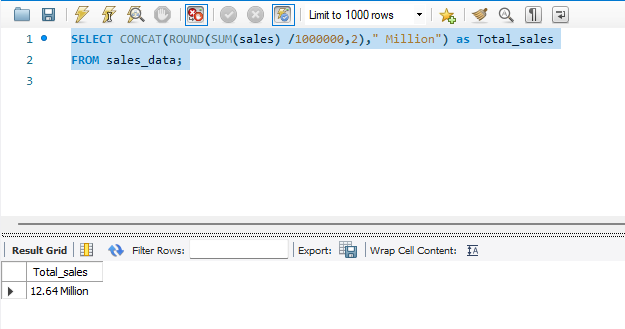
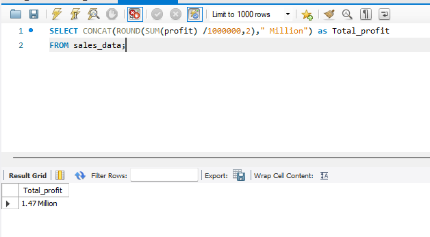
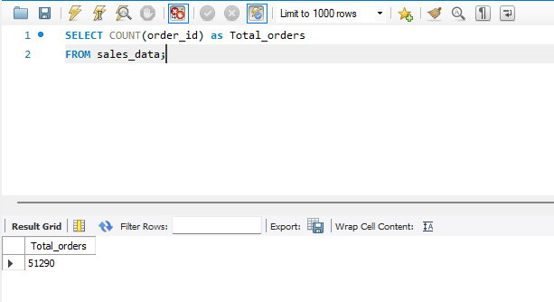
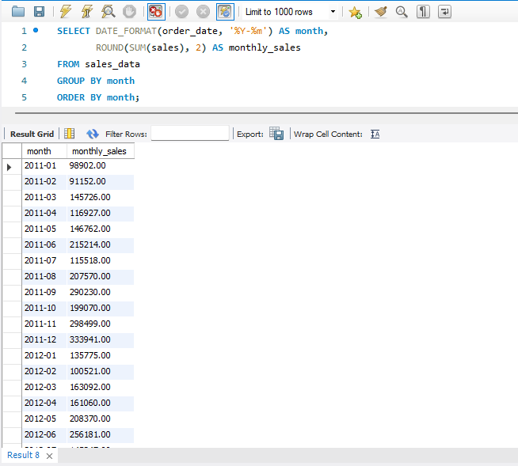
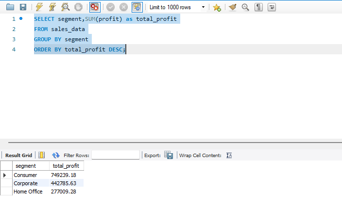
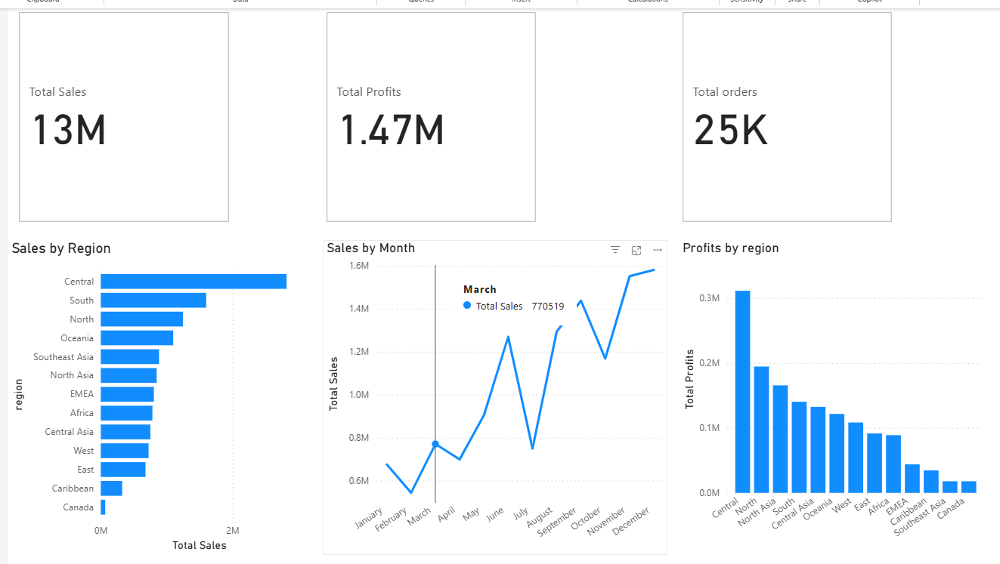
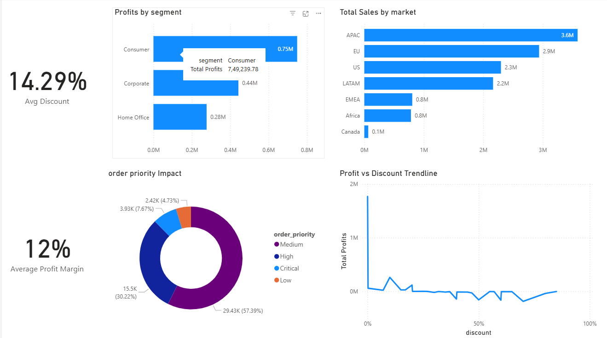

# 📌 Sales Insights Analysis — Power BI + SQL + Python + MySQL  
*Retail Analytics Dashboard & Business Insights*

---

## 📊 Project Overview

An end-to-end analytical project delivering business performance insights using real sales data.  
Developed using:

✔ Python (ETL)  
✔ MySQL (Data Warehouse)  
✔ SQL (KPI analysis & data validation)  
✔ Power BI (Visualization & storytelling)

---

## 🎯 Business Objectives

- Analyze **global sales, profits & order volume**
- Identify **profitable segments, markets & categories**
- Measure **discount impact** on profit
- Support retail business decisions with insights

---

## 🧱 Data Pipeline Architecture

| Stage | Tool | Output |
|-------|------|--------|
| Data Source | CSV (Superstore Orders) | Raw data |
| ETL | Python + Pandas | Clean, structured data |
| Data Storage | MySQL | Fact table |
| Analytics | SQL | Business insights |
| BI | Power BI | Dashboards |

---

## 🗄️ Data Model (Star Schema)

**Fact Table**  
`SuperStoreOrders` → Sales, Profit, Discount, Shipping Cost, Quantity

**Dimension Table**  
`DateTable` → Date, MonthName, Year, Quarter, Week, Calendar labels

🔗 Relationship:  
DateTable[Date] (1) → (*) SuperStoreOrders[order_date]
Cross-filter: Both

---

## 🧩 SQL Results

### KPI Metrics

### Top Products Analysis

### Category Performance

### Regional Performance

### Monthly Trend

### Segment Performance

## 📊 Power BI Dashboards

### Page 1 — Sales Overview

### Page 2 — Product & Category Insights

### Page 3 — Customer & Profitability Analytics

---

## 🔎 Key Business Insights

- **Central region** = highest revenue & profit
- **Technology** = strongest revenue contributor
- **Furniture** = low margin → pricing improvement needed
- **High discounts (40%+) = Net losses**
- **Consumer segment** delivers **best profitability**

---

## 🛠️ Technology Stack

| Tool | Usage |
|------|------|
| Python | ETL Data cleaning |
| Pandas | Type casting, formatting |
| MySQL | Warehouse & SQL queries |
| SQL | KPI analysis |
| Power BI | Visualization |

---

## 📂 Repository Structure

sales-insights-project/
│-- Sales_Insights_Dashboard.pbix
│-- load_SuperStoreOrders_mysql.py
│-- sql_queries.sql
│-- README.md
└── Images/
├─ *.png (screenshots)

---

## 🧠 Resume Highlights

- Built **scalable ETL → SQL → BI** pipeline  
- Designed **star schema** for time intelligence  
- Executed **advanced SQL** for business KPIs  
- Delivered insights for **profit optimization**

---

## 👤 Author

**Arun Pandiyan**  
Data Analyst | Aspiring Data Engineer  
📍 India  

🔗 LinkedIn: https://www.linkedin.com/in/arunpandiyan-thanasekaran/  
💻 GitHub: https://github.com/nameisarun  
